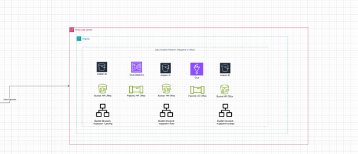

# Descriptive Analysis - Project 1
# Project Description: Descriptive Analysis of Occupational health and safety at UCW
# Project Title: Understanding Inspection report of incident happened on 2024
- Objective: The primary goal of this project is to conduct a descriptive analysis of the Inspection report. Through this analysis, I aim to summarize key characteristics of inspection completions, identify trends, and generate insights that can inform health and safety strategies to UCW.
# Dataset: The dataset includes descriptive data from Occupational health and safety at UCW over the recent year 2024, containing the following key features:
- No of incident: Unique identifier for each incident
- Date: Date and time of the incident
- Department: Department name
- Issue : What is the issue for the incident happened 
- Severity : Medium, High , Low
- Location : What is the exact place that incident happened
- Status : Current status
- Action taken : What kind of action taken
# Methodology:
# Steps
# 1- Data Collection and Preparation:
- Load the dataset using data analysis tools (Excel) .
- Perform data cleaning to address missing values, correct data types, and remove duplicates.
# 2- Descriptive Statistics: 
This section should summarize key statistics using data stored in the S3 bucket “ hr-occupational-health-and-safety-imesha “ in its different stages (landing, raw, curated) and processed via an ETL pipeline.
# Landing Zone (S3 Bucket - Landing Folder):
- Upload the original dataset.
- The dataset should contain raw data about incidents such as the incident ID, date, department, severity, and status.
# Raw Zone (S3 Bucket - Raw Folder):
- After the ETL pipeline processes the data from the landing zone, store the cleaned data (with corrected data types, missing values addressed, and duplicates removed) here.
Curated Zone (S3 Bucket - Curated Folder):
- After completing the transformations and aggregations, store the final summarized data here.
- The data here should include cleaned and processed insights ready for analysis and visualization.
# 3- Data Visualization: 
- In this section, use Draw.io for visualizing data insights , for visualizations created based on the curated data in the S3 bucket after ETL processing.
# 4- Recommendations: 
- Improving Health and Safety Protocols:
- Departments with high incident frequency should receive targeted safety training and enhanced protocols.
- Recommend focusing on departments that show high incident counts in the curated data.
- Severity Reduction:
- Suggest additional safety checks in areas with a high percentage of medium to high severity incidents, as identified in your visualizations.
- Incident Tracking and Resolution:
- Use data stored in the curated folder to enhance the tracking of ongoing and pending incidents, recommending an automated process for quick updates and alerts.
# Tools and Technologies:
- Excel , AWS Services, S3 bucket
- Data visualization tools : Draw.io ,ETL pipeline
# Deliverables:
- A detailed report summarizing the methods, findings, and recommendations.
- Visualizations and dashboards to present key insights clearly.
- A presentation for particular department head to communicate important findings and suggestions for future action.
# This descriptive analysis project aims to provide a comprehensive understanding of incidents happened at UCW and to improve health and safety procedures and policies at UCW to mitigate the accidents.
- Screen shot 1 : Operational environment analysis and Data analytics Platform 

- Screen shot 2 : Descriptive data set under operational environment

- Screen shot 3 : Descriptive data set under Analytical environment (S3 Bucket)
.png)
- Screen shot 4 : Draw.io pipeline workings - Inspection completed rate visualization

- Screen shot 5 : ETL Pipeline for inspection data set

- Screen shot 6 : Data stored under curated folder in S3 bucket

# Data Wrangling - Project 2
# Project Title: Data Wrangling for Enhanced Occupational Health and Safety Analytics at UCW
# Objective:
- The primary goal of this project is to perform comprehensive data wrangling to prepare a robust dataset for occupational health and safety analytics at UCW. By cleaning, transforming, and consolidating data from various inspection reports and safety logs, the project aims to enhance the accuracy and usability of safety-related data for subsequent analysis and reporting. This will help in identifying trends, mitigating risks, and improving workplace safety protocols.
# Background:
- UCW has accumulated inspection data from multiple departments regarding occupational health and safety incidents. However, this data is often inconsistent, incomplete, or fragmented, making it difficult to derive actionable insights. Effective data wrangling will enable UCW to make informed decisions and develop targeted safety strategies to reduce workplace risks and incidents.

# Dataset: The data wrangling process will involve various datasets, including:
- Incident Reports: Records of workplace incidents, including unique incident IDs, dates, departments, issues, severity levels, and current status.
- Safety Logs: Details of safety inspections, actions taken, and follow-up measures.
- Department Information: Metadata about UCW departments, including department names and headcounts.

# Methodology:
# 1.Data Collection:
- Gather datasets from various sources (inspection reports, safety logs) and import them into AWS S3 for storage
- Use AWS Glue to catalog the datasets, including details like incident ID, date, department, issue, severity, and status, creating a metadata repository for easy data discovery and management.
# 2.Data Assessment:
- Utilize AWS Glue DataBrew to perform an initial assessment of the inspection report data. This includes identifying missing values, duplicates, and inconsistencies (e.g., discrepancies in incident dates or severity ratings).
- Use DataBrew profiling tools to document data types, formats (e.g., date formats), and any issues across datasets.
# 3.Data Cleaning:
- Leverage AWS Glue DataBrew to address missing values in inspection reports, either by imputation or exclusion depending on the data's context (e.g., missing incident descriptions or incomplete actions).
- Standardize formats for fields such as dates, department names, and severity levels (e.g., “low,” “medium,” “high”) using DataBrew transformations.
- Remove duplicate entries for incidents and normalize categorical variables like incident status ("resolved," "pending," etc.).
# 5.Data Consolidation:
- Set up AWS glue data brew consolidate datasets into S3 bucket (in raw folders)
- Set up AWS Glue ETL jobs to consolidate datasets and store the consolidated data in S3 (in curated folders) for future analytics and reporting, providing a unified view of health and safety data.
# 6.Documentation and Validation:
- Document the data wrangling process using AWS Glue’s catalog features, detailing data sources, cleaning methods, and transformations applied to the occupational health and safety data.
- Validate the final dataset through exploratory analysis using AWS Athena to ensure the data is complete and accurate, ready for insights into workplace safety trends, departmental performance, and incident resolution effectiveness.
# Tools and Technologies:
- AWS Glue and AWS Glue DataBrew for data cleaning, transformation, and ETL.
- AWS Athena for querying and performing analysis on structured datasets in S3.
# Deliverables:
-	A cleaned and transformed customer dataset ready for analysis, available in a suitable format (e.g., CSV, Excel Database).
-	A comprehensive report documenting the data wrangling process, including challenges encountered, methods employed, and final dataset characteristics.
-	Visualizations illustrating the key data insights and confirmations of data quality checks were conducted during the process.
#	Timeline:
- Expected completion of the project: 6 weeks, including phases for assessment, cleaning, transformation, and documentation.
  
This modified project description ensures that the project objectives and datasets align with the HR-Occupational Health and Safety domain and UCW's inspection report analysis.
# Screen shots
- DAP from Draw.io
  
